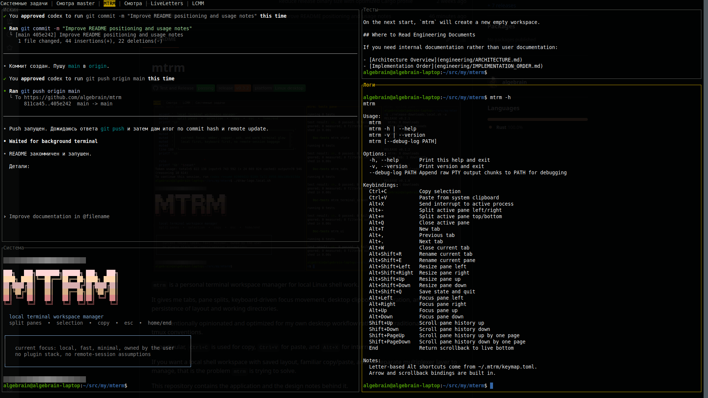

# mtrm

[](https://github.com/algebrain/mtrm/actions/workflows/rust.yml)
[](https://github.com/algebrain/mtrm/releases)
[](https://github.com/algebrain/mtrm)



`mtrm` is a personal terminal workspace manager for local Linux shell work.

It gives me tabs, pane splits, keyboard-driven focus movement, desktop clipboard integration, and automatic persistence of layout and working directories.

It is intentionally opinionated and optimized for my own desktop workflow rather than traditional terminal or tmux conventions.

In particular, `Ctrl+C` is used for copy, `Ctrl+V` for paste, and `Alt+X` for interrupt.

If you want a local shell workspace with saved layout, familiar copy/paste, and no separate multiplexer layer to manage, that is the problem `mtrm` is trying to solve.

This repository contains the application and the design notes behind it.

## What It Does

- Runs local shells in PTYs
- Supports multiple tabs
- Splits the active tab into multiple panes
- Moves focus between panes with the keyboard
- Copies and pastes through the desktop clipboard
- Saves and restores layout, active tab, active pane, and pane working directories

By default, `mtrm` starts `$SHELL -i`. If `$SHELL` is not set, it falls back to `/bin/sh -i`.

`mtrm` does not restore old live processes after restart. It recreates fresh shells in the saved working directories.

## Scope and Limits

`mtrm` is currently a Linux-first tool for local desktop use.

More specifically, the implementation in this repository has been tested on:

- Linux Mint 22.3

Current expectations:

- It is meant to run locally on a Linux desktop session
- It is not designed as a remote terminal or server session manager
- It can start even when the local system clipboard backend is unavailable
- Clipboard support depends on the local desktop environment; in headless or remote sessions built-in copy and paste may be unavailable
- State restore brings back layout and working directories, not old running processes
- Windows and macOS builds are not supported targets yet

## Installation

### Download from Releases

GitHub Releases publish Linux artifacts you can download directly:

- `mtrm.deb`
- `mtrm`
- `mtrm-x86_64-unknown-linux-musl`

Use them like this:

- `mtrm.deb`: Debian or Ubuntu-style installation
- `mtrm`: the regular GNU/Linux executable
- `mtrm-x86_64-unknown-linux-musl`: a statically linked Linux binary for systems where the regular executable fails with errors such as `GLIBC_x.y not found`

At the moment, the supported release targets are Linux only.

### Build and run from source

From the repository root:

```bash
cargo run -p mtrm
```

This starts `mtrm` with your current `$SHELL` in interactive mode.

To simulate a session without system clipboard integration:

```bash
cargo run -p mtrm -- --no-clipboard
```

### Install into `~/.local/bin`

```bash
cargo install --path app --root ~/.local
```

If `~/.local/bin` is in your `PATH`, you can then run:

```bash
mtrm
```

### CLI options

`mtrm` also supports a few direct CLI flags:

```bash
mtrm --help
mtrm --version
mtrm --no-clipboard
mtrm --debug-log /tmp/mtrm-pty.log
```

- `--help` / `-h` prints help and exits
- `--version` / `-v` prints version and exits
- `--no-clipboard` disables system clipboard integration even if it is available
- `--debug-log PATH` appends raw PTY output chunks to `PATH` for terminal-debugging sessions

## Default Keybindings

- `Ctrl+C`: copy selected text
- `Ctrl+V`: paste from the system clipboard
- `Alt+X`: send `SIGINT` to the active process
- `Alt+-`: split the active pane left/right
- `Alt+=`: split the active pane top/bottom
- `Alt+Q`: close the active pane if it is not the last one
- `Alt+T`: open a new tab
- `Alt+Shift+R`: rename the current tab
- `Alt+Shift+E`: rename the current pane
- `Shift+F1`: open the help overlay
- `Alt+Shift+Left` / `Alt+Shift+Right` / `Alt+Shift+Up` / `Alt+Shift+Down`: resize the active pane by one cell
- `Alt+,`: previous tab
- `Alt+.`: next tab
- `Alt+W`: close the current tab if it is not the last one
- `Alt+Shift+Q`: save state and quit
- `Left` / `Right` / `Up` / `Down`: send arrows to the active shell
- `Alt+Left` / `Alt+Right` / `Alt+Up` / `Alt+Down`: move focus between panes
- `Shift+Up` / `Shift+Down`: scroll pane history by one line
- `Shift+PageUp` / `Shift+PageDown`: scroll pane history by one screen
- `Home`: send Home to the active shell
- `End`: return to the live bottom of the active pane

Letter-based shortcuts are configured through `~/.mtrm/keymap.toml`.

If the system clipboard is unavailable, or if a clipboard read or write fails at runtime, `Ctrl+C` and `Ctrl+V` stay assigned to copy and paste, but `mtrm` shows a short notice inside the UI instead of exiting.

The same short-notice path is also used for other recoverable runtime failures such as state-save errors and user actions that cannot be completed.

The help overlay uses the same text as `mtrm --help`. It opens centered over the UI, closes with `Esc`, and supports scrolling with arrows and `PageUp` / `PageDown` on smaller terminals.

The bundled default keymap already covers:

- Latin layouts, including English, Spanish, and Portuguese
- Russian
- French AZERTY
- Greek

## Persistent Files

`mtrm` creates `~/.mtrm` automatically.

Important files:

```text
~/.mtrm/state.yaml
~/.mtrm/keymap.toml
```

If `~/.mtrm/state.yaml` is missing, `mtrm` can still read a legacy `~/.mtrm/state.toml`, but new saves are always written as YAML.

Scroll position is not persisted. After restart, panes reopen at the live bottom.

When the terminal window loses focus, the active tab and active pane border turn red.

## Documentation

User-facing documents:

- [User Guide](docs/USER_GUIDE.md)
- [Why Not tmux](docs/WHY.md)
- [Application README](app/README.md)

Engineering documents:

- [Architecture Overview](docs/engineering/ARCHITECTURE.md)
- [Implementation Order](docs/engineering/IMPLEMENTATION_ORDER.md)
- [Portability Notes](docs/engineering/PORTABILITY_NOTES.md)
- [Terminal Emulation Notes](docs/engineering/TERMINAL_EMULATION.md)
- [Engineering Idea](docs/engineering/idea.engineering.md)
- [Original Idea Draft](docs/engineering/idea.preliminary.md)

## Version Output

`mtrm --version` prints two parts:

- the latest local git tag, for example `v0.1.1`
- the modification time of the current executable in Unix seconds

This means the suffix after the space changes when the installed binary file itself changes.
